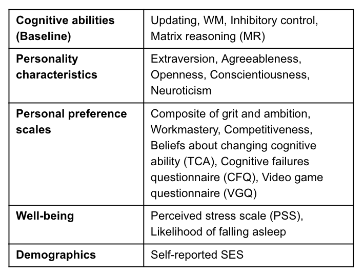
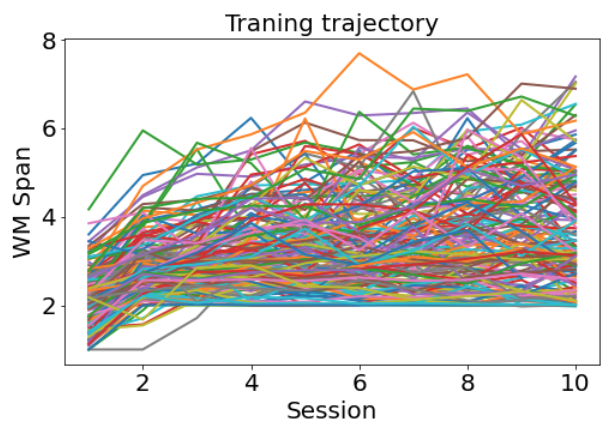
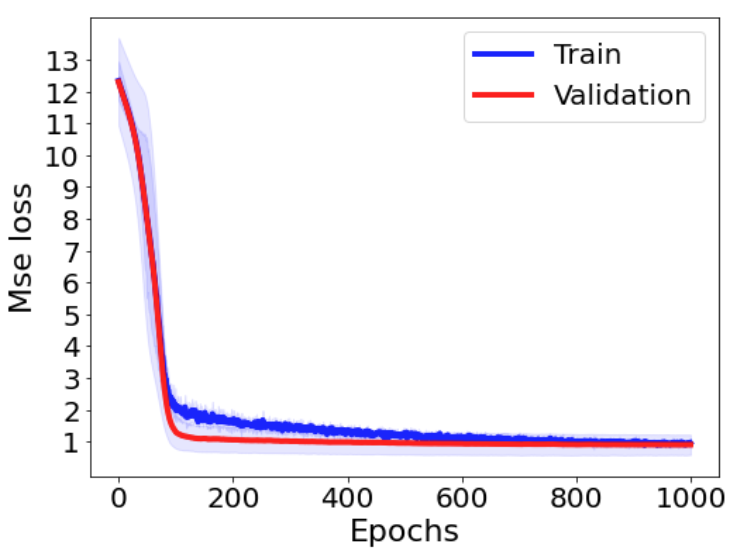
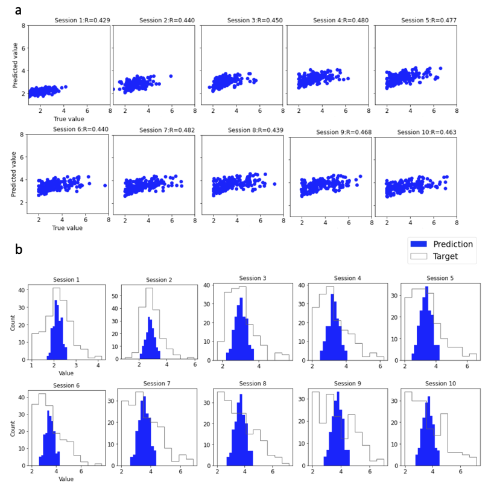
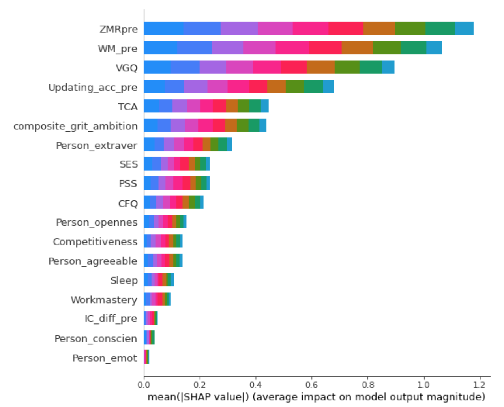
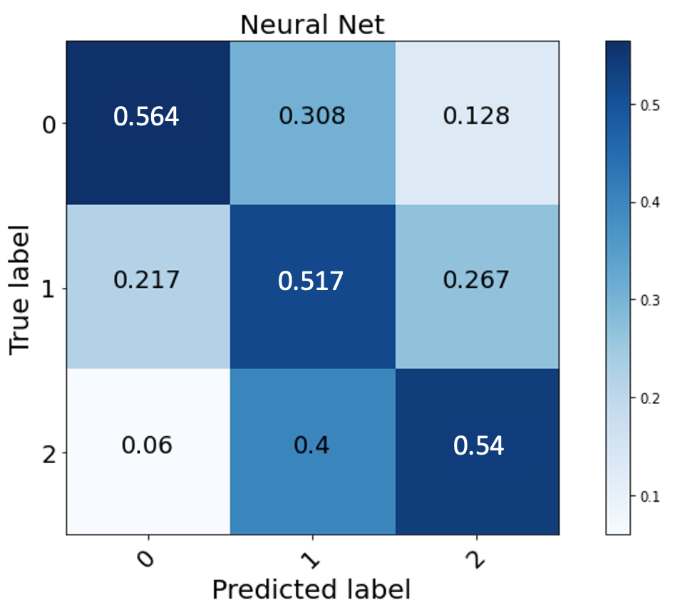

# Predicting working memory training outcome using a MLP model 
## Introduction
Working memory (WM) is a cognitive function that represents one's ability to hold information temporarily and focusing on the current task. It’s important for learning and everyday working. Many researchers have found that working memory capacity can be improved by training (Shipstead et al., 2012). However, some individuals benefit more than others. Individual differences have been discussed as potential factors determining benefits from WM training, and several papers have examined the independent effect of selected variables on WM training outcome (Morrison & Chein, 2011). For example, Foster et al. (2017) found that participants with high initial WM ability showed more gains relative to the low initial WM ability participants. However, some other researchers found larger training gains for individuals with lower baseline performance (Zinke et al., 2014). Besides baseline cognitive ability, motivation, and personality traits may also play an important role in affecting WM training gains through interacting with intervention-specific features (Von Bastian & Oberauer, 2014). Infer from previous studies, individual difference variables are likely to be combined to affect the training gains. If only taking one or two factors into account, inconsistent findings might be observed in different samples. To overcome those limitations, here we are using several individual differences variables at once to predict WM training performance. 

In the current study, we used multiple variables as features and applied a fully connected neural network to train a regression model to predict individuals’ training outcomes. In recent years, machine learning and deep learning methods have been applied in Psychological science and cognitive neural science fields. Facebook behavior (Likes) can predict personality by using a machine learning model which is more accurate than those made by the participants’ friends (Youyou et al., 2015); Deep learning is used successfully in brain image data to classify psychiatric disorders (Vieira et al., 2017). However, it’s hard to find studies that used machine learning in the analysis of experimental behavior data. Many experimental results are analyzed by p-value statistical inference because researchers care about the relationship between variables. In our case, we want to take advantage of machine learning or deep learning models to more focusing on prediction at the single-subject level.
## Methods
### Participants
170 undergraduates completed one of several N-back intervention variants over the course of 2 weeks. Each subject finished one training session per day of 40 minutes with a break, a total of 10 sessions. Each session has multiple blocks, each block took 2-3 minutes. 
### Training program
Before training, participants completed a series of assessments and questionnaires capturing baseline cognitive abilities, the big five personality traits, and other scales representing their cognitive preferences and well-being. In total, we used 18 individual variables, as illustrated in Table 1. The N-back training program was generated by software developed by University of California Riverside Brain Game Center (Deveau et al., 2015). In the games, participants are presented with a series of stimuli of different shapes and colors. They were asked to respond to stimuli that match the stimulus N items back. For instance, in a 1-back task, participants should press a button if the current stimulus is at the same as the stimulus presented 1 item before. Higher levels of N increase the task difficulty which is adaptively adjusted based on participants’ performance. Training outcome is the average N level during a session, called WM span. The 10 sessions training trajectory for each participant showed in Figure 1.  
|||
|:-:|:-:|
|Table 1. Individual differences variables|Figure 1. Training trajectory|

### MLP model
We used a multilayer perceptron model, which is a fully connected neural network. After tried with different hidden layer sizes, we decided to use an MLP model that consists of 4 layers. An input layer that has the 18 variables. Two hidden layers with 20 nodes and 10 nodes, respectively. An output layer is the 10 training outcomes. The activation function in each layer was the rectified linear unit function. To avoid possible overfitting, we added a drop out (0.5) layer after the first hidden layer. Mean squared error (MSE) was used as loss function and Stochastic gradient descent was chosen as the optimizer. To best utilize our small data samples, 5-fold cross-validation was used. The prediction performance was measured as the average minimal MSE loss of 5 folds. After 1000 epochs, the average minimal MSE loss is about 0.886 (RMSE = 0.941). The learning curve showed in Figure 2. To choose an optimal model, we set a threshold (validation loss <0.6) that to make the difference between prediction and the true value was within 0.8 level.

  
Figure 2. Learning curve (For model MLP (18,20,10,10), epochs=1000; the validation curve surrounded by +/-1 SD range) 

## Results
The prediction for each session by using the MLP model was showed in Figure 3a. The correlation between the true value and our prediction in each session is about 0.4, which means a low prediction power. To get a better sense of how the prediction looks like, the distribution of the true value and the predicted value of each session were showed in Figure 3b. From this figure, we found that the mean of the predicted values increased across sessions and similar to the mean of true values. But the kurtosis of predicted value higher than the true value means more concentration toward the mean. The model didn’t catch the whole range of true values.  
   
Figure 3. Prediction by applied the MLP model (a. Correlation between true value and predicted value;b. Distribution of true value and predicted value)

To explain how the model used these features to make predictions, SHAP (SHapley Additive exPlanations) value was introduced (Lundberg & Lee, 2017). “It interprets the impact of having a certain value for a given feature compared to the prediction we'd make if that feature took a base value”. By using the SHAP tool, we can calculate the mean of SHAP value for each feature to represent feature impact (See Figure 4). The results demonstrated that matrix reasoning (it is a measurement of fluid intelligence) and baseline working memory have the most impact in predicting. Interestingly, the frequency of playing video games also play a role in predicting.  
     
Figure 4. SHAP values for all features (sort by impact, different colors represent different sessions)
## Discussion
There are many possible reasons why we didn’t have a good prediction by using the MLP model. a) The features didn’t have the power to predict the exact N level of each session but can predict participants' training patterns. I have tried to convert the regression model to be a classification model. First, I used a k-means clustering that assigned each participant to one of three groups according to their 10 sessions WM levels. Then, I applied an MLP with just one hidden layer that has 5 nodes to predict which group the participants are in. It showed a 0.543 mean accuracy (chance level 0.333). The confusion matrix was in supplementary Figure 1. It seems the prediction power to predict the training pattern is higher than to predict the value in each session. 
   
 Supplementary Figure 1. Confusion matrix by using a MLP model for classification 

b) The MLP model is not the best machine learning model for this dataset. Further analysis could be trying other models like the random forest. c) For now, we just have a very small sample size. The training performance didn’t vary much among participants. Most of the participants’ training performance was in the range of 2 to 4 level. After we have more data, we may get more variance. d) The training outcomes across sessions were not independent. Participants’ level in the first session would affect their level in session 2. Therefore, if we have more data, a recurrent neural network might be the model more fitted in our dataset. Since only few studies used machine learning models in experimental behavior data analysis, this study is an exploratory research hopefully can provide some lessons to learn.
## References
1.	Shipstead, Z., Redick, T. S., & Engle, R. W. (2012). Is working memory training effective?. Psychological bulletin, 138(4), 628.
2.	Morrison, A. B., & Chein, J. M. (2011). Does working memory training work? The promise and challenges of enhancing cognition by training working memory. Psychonomic bulletin & review, 18(1), 46-60.
3.	Foster, J. L., Harrison, T. L., Hicks, K. L., Draheim, C., Redick, T. S., & Engle, R. W. (2017). Do the effects of working memory training depend on baseline ability level?. Journal of Experimental Psychology: Learning, Memory, and Cognition, 43(11), 1677.
4.	Zinke, K., Zeintl, M., Rose, N. S., Putzmann, J., Pydde, A., & Kliegel, M. (2014). Working memory training and transfer in older adults: effects of age, baseline performance, and training gains. Developmental psychology, 50(1), 304.
5.	Von Bastian, C. C., & Oberauer, K. (2014). Effects and mechanisms of working memory training: a review. Psychological research, 78(6), 803-820.
6.	Youyou, W., Kosinski, M., & Stillwell, D. (2015). Computer-based personality judgments are more accurate than those made by humans. Proceedings of the National Academy of Sciences, 112(4), 1036-1040.
7.	Vieira, S., Pinaya, W. H., & Mechelli, A. (2017). Using deep learning to investigate the neuroimaging correlates of psychiatric and neurological disorders: Methods and applications. Neuroscience & Biobehavioral Reviews, 74, 58-75.
8.	Deveau, J., Jaeggi, S. M., Zordan, V., Phung, C., & Seitz, A. R. (2015). How to build better memory training games. Frontiers in systems neuroscience, 8, 243.
9.	Lundberg, S. M., & Lee, S. I. (2017). A unified approach to interpreting model predictions. In Advances in neural information processing systems (pp. 4765-4774).
